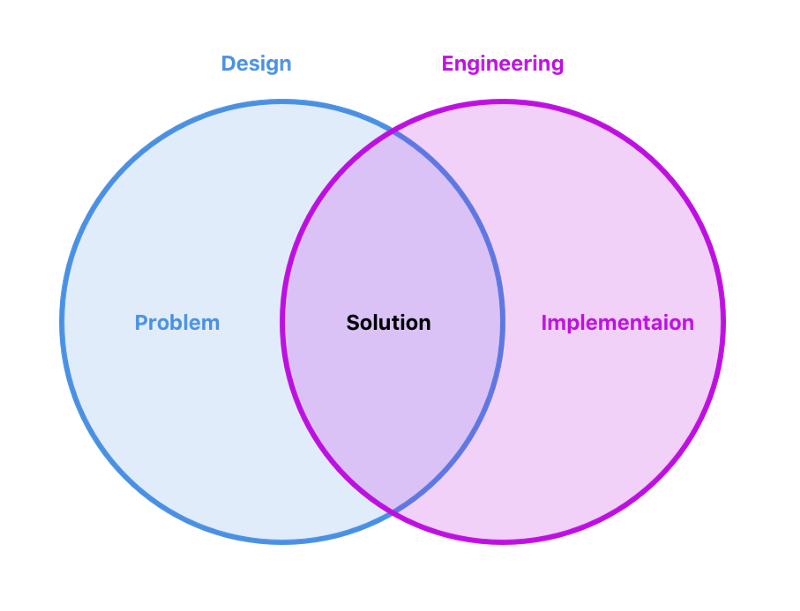

UX contribution to open source projects, specially decentralised ones can be a challenge, intimidating and definitely an area that we need to talk about. Let’s be honest, usually open source projects are seen as these ugly, joyless projects where Designers usually stay miles away and we just assume that UX is not a thing here.

I think differently. I think open source projects where UXers and Designers are actively contributing have an unfair advantage and can “easily” compete with their commercial/corporate counterparts (if any). You can hire talent, but you can’t beat passion.

undefined

If you are a Designer, contributing to an open source project will give you super powers, awesome skills that are highly in-demand in the market.

As a Designer you don’t really need to code (it helps immensely though). But, learning about version control, branching, states, optimising for speed and performance. Having your work exposed to the public from the bare bones (like the first versions when it will be crap), can be intimidating. Definitely it will give you a head start on the on the field and tons of learnings. So embrace it, it is ok to fail, but more importantly always keep learning.

#### **Let’s understand why it is difficult to contribute and special to join the conversation.**

These projects usually stand by the _“code is law”_ _maxima_ from the [Code](http://codev2.cc/download+remix/Lessig-Codev2.pdf) or the “chyperpunks write code” from the [chyperpunk’s manifesto](https://github.com/NakamotoInstitute/nakamotoinstitute.org/blob/master/sni/static/docs/cypherpunk-manifesto.txt). Which are great ways of thinking to stand by, because even though it may seem not very inclusive, they define constraints, and constraints are a good thing, they give us focus. In this case, open source projects, these constraints define that to discuss a topic you need to have a basic understanding of its implications and outcomes.

That’s what these principles essentially mean. It doesn’t mean that if you are not the best coder in the world you can’t participate, it means you need to understand the implications of your proposal to have a meaningful opinion/proposal about a subject.

#### **Understanding Design and Engineering**

The second thing we need to understand is the difference between Design and Engineering. Design is a broad topic, it means different things. It definitely doesn’t mean beautiful drawn interfaces, that’s a specific area of design called “Visual design or UI Design”.

Essentially Design is the area of figuring out what problem needs to be fixed and how to fix it. And, Engineering is how to implement that fix or improvement. If we are not solving a problem we are not doing Design.

I like to put it as this:  
Design = What is the problem  
Design + Engineering = What is the solution to the problem  
Engineering = How to implement the solution

(Notice how the solution doesn’t come from one area. Also, be aware that if you are an engineer you should be doing some design, and if you are a designer you can also and should do some engineering.)

### **How to contribute to Open Source from a Design perspective**

Let’s take a look on how I think it is a good approach to join the discussion, and how to start contributing to Open Source.

Usually the wrong approach here is someone going in and asking to redesign things, propose huge changes, completely go on a different direction, without having context. That’s just impractical and can be annoying. So what’s an alternative?

#### **1\. Understand the context**

It is imperative to understand the context. And the context here can be things like:

*   Does the project have a roadmap to follow?
*   Do they do small changes or big chunks?
*   How do they work, do they have issues/tickets, or is it any man for himself?
*   Which are the previous discussion and consensus (important concept) or conclusions taken.

Essentially get familiar with the way they work, who they are, their motivations and their goals.

#### **2\. Define a problem to solve**

Defining a problem is a concept that people tend to fail in most areas. This is extremely important to provide context to people, define the work direction and most importantly to know if the change was successful in the end. Which when working remotely, with different people, with different backgrounds will help you and take you further away then starting with a solution. Also, it is way easier to agree on a problem that it is to agree on a solution.

**Let’s take Bitcoin Core’s wallet as an example.**

*   Problem 1 (bad): The wallet looks outdated needs a redesign;
*   Problem 2 (good): The icons are pixelated;
*   Problem 3 (good): There’s areas with low readability;
*   Problem 4 (good): Once I installed it I don’t know what should I do next.

In these examples there is one that I would consider bad and three that I would consider good. What is essential to understand here is that, smaller and clearly is the problem, easier will be to fix it or to agree upon on it.

So usually what you do is to break-down a problem into smaller problems, till it is very clear to everyone what it means.

**How do you do this? By asking “why”.**

*   The wallet looks outdated needs a redesign;

Why?

*   The icons are pixelated;
*   There’s areas with low readability;

And so on so forth… To know more search for the “5 why’s technique” on problem solving

#### **3\. Discuss and gather feedback**

Now that you have your problem and you have broken it down, it is very important to do something called “fast feedback loops”.

From the moment you have something, start sharing it. Get feedback, explain why you would like to solve it and why you see it as a problem. See what other people think about it. Do they think it is a valid problem, have they seen it before, is there any data/info that can validate that the problem exists? Etc…

How do you go about it? At this point you are already familiar with their context. Are they using github issues, are they discussing this kind of things on an IRC channel. Do they use a mail list? Is there any formal process for this kind of proposal?

Usually it is very important to get feedback in some form right away, before any solutions are proposed. That’s why starting by sharing the problem to solve is a very good approach on how to go about it.

#### **4\. Iterate**

Take feedback seriously. Star iterating right away! The problem could be something that is not that important at the moment, there could be other things that can bring more impact, etc. Or every one agrees that this should be fixed, that’s great, start to collect ideas on how to fix it right away.

Start iterating! Design can help to speed up this typical cumbersome processes.

#### **5\. Share ideas/create ideas**

Here, it can be complex due to the nature of the remote collaboration. But ask first if anyone wants to do an “ideation session” or a “design sprint”. Or any other solution design technique that you may see fit.

If not just go by yourself, many projects work on the “every man for himself” philosophy. If that’s the case just start designing solutions by yourself. The important thing here is that you keep the process open as much as possible. Work on one solution, share, get feedback, iterate and so on.

#### **6\. Go low-fi**

How to go about solutions and ideas. Easy, go low-fi as much as possible. Try to avoid High-fidelity, usually this projects go better with a simple design system or a style guide, than trying to re-invent the wheel every time some GUI needs to be done or changed. Remember that these are distributed/decentralised projects, open source is hard to change. Separate Solutions to problems from the GUI work as much as possible. Make people’s lives easier.

What is usually more impactful:

*   User Flows
*   Mockups
*   Prototypes
*   Interaction Design
*   States Design (success, errors, warnings)
*   Copies

#### **7\. Openly share all the process**

As previously stated, share! And here is where outputs and artifacts can help. Sketch, Figma, Zeplin, Invision, Abstract, etc. They are great tools, but not the most important.

Communicate, facilitate the sharing, find easy ways to visualize the concepts, easy ways to comment and provide feedback. Try to avoid having many tools, and try to be as close as the code as possible. Is the team using Github? Cool, start there. It is enough to show work and provide comments. Adapt to them, don’t try to make them adapt to you right away. Tools are just tools, don’t get obsessed with them.

#### **8\. Repeat from 3, till consensus**

We have our solutions, we have kept it simple, we shared everything. Now it is a no brainer, repeat from 3, and iterate till consensus.

At this point the Engineers are familiar with the problem, they participated in defining the solution. From here to implementation they will be your best allies. Consensus at this point just comes naturally and there’s no need for violent reactions. All the heavy work was previously done :)

Hope this set of thoughts and advices can be helpful to guide you on your open source adventure. Of course the work doesn’t end here, there’s testing, there’s Q&A, there’s designer to engineering feedback, yes, it also goes the other way around. There’s many other related topics, and ways to help that not necessarily mean coding. But, that’s for another post.

Try to have fun along the way. Software is not about code being law, it is about the ride, and it is about the people, the best ones are waiting for you on the Open Source interwebz. Code is just a tool as it is Design. Enjoy!