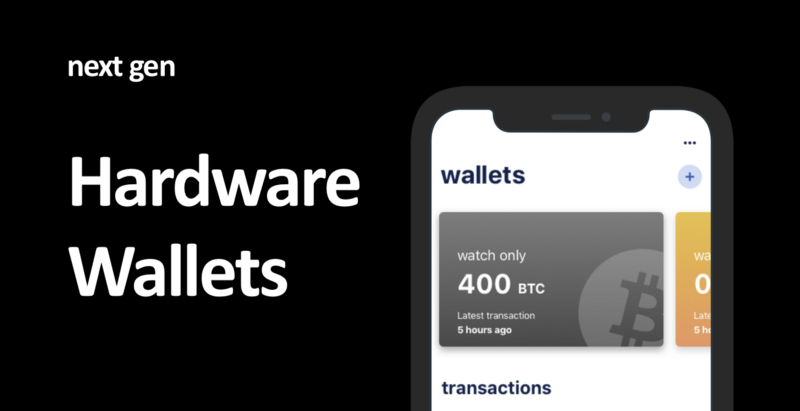
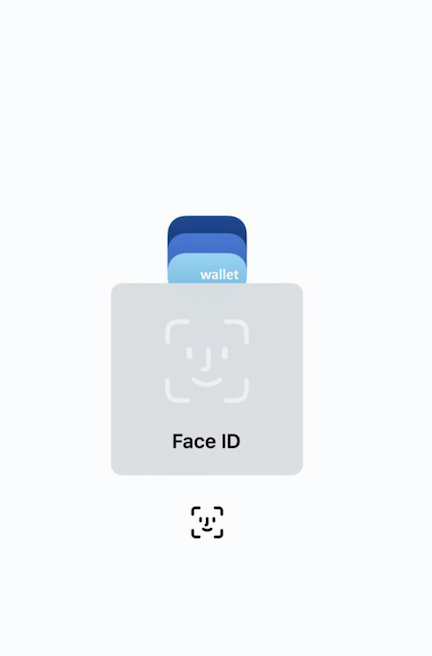
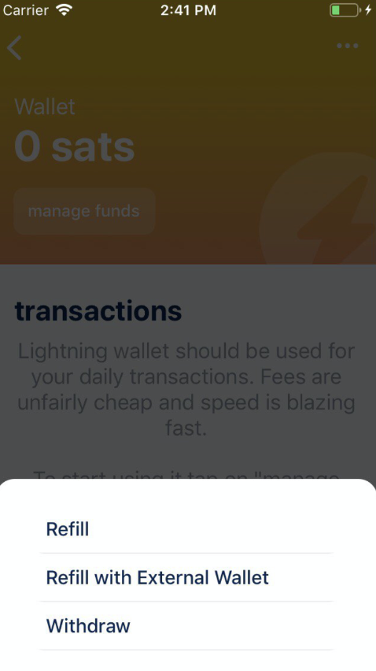

### What’s new

#### Hardware wal­let sup­port (for BIP84) via PSBT and QR codes

undefined

A new generation of hardware wallets are dropping to the market. Like [coldcard](https://coldcardwallet.com/) and [cryptoadvance](https://cryptoadvance.io/) in some months. This wallets have some differentiations from what we are used to. They are Bitcoin-only, Air-gapped and support **Partially Signed Bitcoin Transactions, or PSBT**.

Why is this important and why you should learn about it, you may ask :)

PSBT is a _new standard_ for Bitcoin transactions, and having a standard basically means that the wallets supporting it will have “interoperability” between each other (hopefully).

Many people keep their coins on this devices called hardware wallets (HWs). A subset of those people also require two HWs to cosign any transaction that moves their coins. PSBT lets you export a code that another HW can scan-and-then-sign without **exposing your keys to the internet**. The same works just for one signature.

Another interesting use case by adding support for PSBT on Bluewallet is that if you have an old phone where you can remove your wifi module and GSM module you can create an air-gapped hardware wallet from your phone. Then, create a PSBT transaction on your bluewallet hot wallet and sign it with your bluewallet cold wallet :)

**How to use it**

Import zpub > wallet options > activate hardware wallet > Send — to create PSBT

  

Huge props to [Igor Korsakov](https://twitter.com/overtorment) from Blue and [Stepan Snigirev](https://twitter.com/stepansnigirev) from CryptoAdvance on making this a reality.

#### Op­tion­al bio­met­rics un­lock 

Biometrics are just an easy way to unlock your app. However, it does not unlock Encrypted Storage, and it is an optional feature. Please be aware of the limitations of biometrics before using them.

undefined

#### Lightning Re­fill with ex­tern­al wal­let

This was possible before, but now there’s a visible option to do so. So you can easily refill your [Lightning wallet](https://bluewallet.io/lightning/) from a Bitcoin wallet.

undefined

  

  

#### De­fault wal­let on launch

There’s many users with just one wallet, so if you want to make your app open directly on your main wallet, there’s an option on the settings called “on launch” where you can set this option.

### What was fixed

*   NaN when send­ing on­chain
*   Zero on send suc­cess screen
*   Time shown for latest transaction
*   Minor is­sue with scan­Qr­Wif
*   Typo on NL lan­guage
*   Bet­ter wal­let ex­port QR read­ab­il­ity
*   RBF tx memo port­ing
*   Bet­ter ini­tial HD res­can